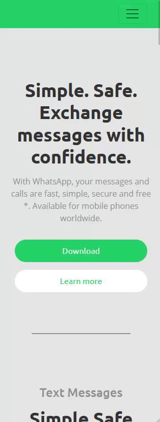

## Recriando a interface da Netflix

>  Site desenvolvido para estudos e práticas de HTML, CSS, JS, jQuery e Bootstrap

[Acesse o site clicando aqui](https://theslladev.github.io/Whats-App-Web-Landing-Page/)

    

### Tecnologias utilizadas:

* HTML
* CSS
* JS
* [Bootstrap](https://getbootstrap.com/)
* [jQuery](https://jquery.com/)
* [FontAwesome](https://fontawesome.com/)